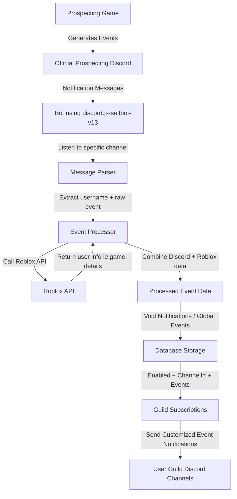

# Discord Event Notification Bot

A custom Discord relay bot that listens to the official Prospecting
Discord server, captures in-game event notifications (Void servers, Merchant stock, Global events), and re-broadcasts them in a more structured way to your own Discord servers.

> ⚠️ This project uses [discord.js-selfbot-v13](https://www.npmjs.com/package/discord.js-selfbot-v13)
> to parse messages from the official Prospecting Discord. Selfbots are against Discord ToS — use at your own risk.

## 📦 Features

### Void Notifications

Relays official rare-finds → into configured channels in your servers.

### Merchant Notifications

- Detects merchant stock changes.

Optional role mentions (@here / @everyone).

### Global Event Notifications

Listens for events like:

- Geode Shower
- Nimue’s Blessing
- Meteor Shower
- Volcanic Eruption
- Solar Flare
- Blizzard
- River Rapids

Guilds can subscribe to one or more events and get notified automatically.

Guild Config via Slash Commands
Configure which channels receive what type of notifications.
Subscriptions are stored in MongoDB.

## ⚙️ How It Works

1. The bot joins the official **Prospecting Discord** server using a selfbot.

2. It monitors specific channels where the official game posts updates.

3. When a relevant message is detected, the bot:

   - Parses it into structured JSON (void server info, merchant stock, event type).

   - Looks up which guilds are subscribed in MongoDB.

   - Sends formatted notifications into those guilds’ configured channels.

---

### Flow Description:

1. **Prospecting Game** → sends in-game events.
2. **Official Discord** → bot listens for those notifications.
3. **Message Parser** → extracts Roblox username & event data.
4. **Event Processor** → calls **Roblox API** to enrich user info (current game, userId, etc).
5. **Processed Data** → merges both sources (Discord message + Roblox API).
6. **Database** → stores guild preferences (enabled events, channelId, etc).
7. **Guild Subscriptions** → filters events per guild config.
8. **User Guilds** → receive **customized, enriched notifications**.

---

## ⚡ Requirements

- Node.js 18+
- MongoDB (local or Atlas)
- Roblox auth cookies
- Discord bot token
- Discord token (for selfbot account)

## ⚠️ Disclaimer

This project is for **educational purposes** only.
Using selfbots on Discord violates the Terms of Service and can result in account termination.

You're lazy? Just invite [this Discord Bot](https://discord.com/oauth2/authorize?client_id=1417428932432498720&permissions=8&integration_type=0&scope=applications.commands+bot).
